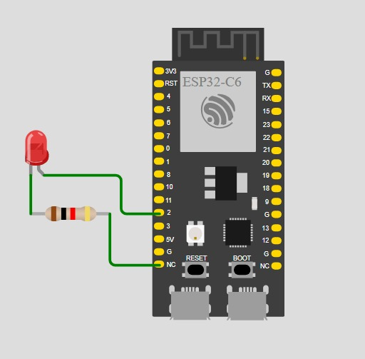

# Lab 1-3 — RTOS Basics with ESP-IDF LAB

**_The purpose of these labs 1-3 is to analyze changes in our code or new behaviors_**

## Lab 1 

### 1) Activity Goals  

**_Activity Goals_**

+ _Implement a multitasking system in FreeRTOS using two concurrent tasks for LED control and serial message output._

+ _Validate the effect of task priorities and task blocking on the behavior of the FreeRTOS scheduler, as well as the prevention of starvation through the use of vTaskDelay._

+ _Document the source code, the results of the conducted experiments, and the observations obtained regarding concurrent task execution._

## 2)Exercises  
1. _Priority experiment: change ```hello_task``` priority from ```5``` to ```2```._
2. _Does behavior change? Why might it (or might it not)?_
3. _Starvation demo:```temporarily remove vTaskDelay(...)```from ```hello_task```._
4. _What happens to blinking?_
5. _Put the delay back and explain in one sentence why blocking helps._

## 3) Materials & Setup  
BOM (bill of materials)

|#|Item|Qty|Link/Source|Cost (MXN)|Notes|
|---------|--------|------|--------|--------|--------|
|1|ESP32|1|amazon|$365|Nothing|
|2|Led|1|Electronic store|$3|Nothing|

**_Tools / Software_** 

* _OS/Env: ESP-IDF with FreeRTOS on ESP32 (Windows)_  
* _Editors: VS Code with ESP-IDF extension, C/C++, Debug/Flash: ESP-IDF_ 

**_Wiring / Safety_**  

* _Board power: USB 5 V from host PC_

* _LED: Onboard LED (GPIO 2)_

* _Safety notes: Verify correct GPIO pin for the board; avoid short circuits during wiring_ 

## 4) Procedure (what you did)  
* _**Step 1:** Create a new ESP-IDF project and configure the target ESP32 board_  
* _**Step 2:** Implement two FreeRTOS tasks: one for LED blinking and one for serial logging_  
* _**Step 3:** Build, flash, and monitor the application using ESP-IDF tools_  
* _**Step 4:** Modify task priorities and observe scheduler behavior_  
* _**Step 5:** Remove and restore vTaskDelay in one task to demonstrate * starvation and recovery_  
* _**Step 6:** Verify correct LED blinking and periodic serial output_   

## 5) Data, Tests & Evidence  
**Test plan:**  

* _Inputs: Task priorities, presence or absence of vTaskDelay_  
* _Expected: Stable LED blinking and periodic log output when tasks are properly blocked_  

**Tables/observations:**  
|Case|Configuration|LED Behavior|Serial Output|Pass|   
|-------------|-----------|-------------|------------|-----------|    
|A|Both tasks priority 5, delays enabled|Normal blinking|Periodic|     
|B|hello_task priority 2, delays enabled|Normal blinking| Periodic|     
|C|without vTaskDelay|Yes / unstable blinking|Continuous output|   
|D|vTaskDelay restored|Normal blinking|Periodic|   

## 6) Analysis  
_Observed behavior matches the expected FreeRTOS scheduling model._  
_When tasks use vTaskDelay, they enter the Blocked state, allowing the scheduler to execute other ready tasks regardless of priority differences_  
_Removing vTaskDelay causes one task to continuously occupy the CPU, leading to starvation of the LED task._  
_This behavior illustrates the importance of cooperative blocking in real-time multitasking systems._  
_Proposed fixes: Ensure all tasks include appropriate blocking calls (vTaskDelay, queues, or synchronization primitives)._  

## 7) Code  
```
#include <stdio.h>
#include "freertos/FreeRTOS.h"
#include "freertos/task.h"
#include "driver/gpio.h"
#include "esp_log.h"

#define LED_GPIO GPIO_NUM_2   // CHANGE for your board

static const char *TAG = "LAB1";

static void blink_task(void *pvParameters)
{
    gpio_reset_pin(LED_GPIO);
    gpio_set_direction(LED_GPIO, GPIO_MODE_OUTPUT);

    while (1) {
        gpio_set_level(LED_GPIO, 1);
        vTaskDelay(pdMS_TO_TICKS(300));
        gpio_set_level(LED_GPIO, 0);
        vTaskDelay(pdMS_TO_TICKS(300));
    }
}

static void hello_task(void *pvParameters)
{
    int n = 0;
    while (1) {
        ESP_LOGI(TAG, "hello_task says hi, n=%d", n++);
        vTaskDelay(pdMS_TO_TICKS(1000));
    }
}

void app_main(void)
{
    ESP_LOGI(TAG, "Starting Lab 1 (two tasks)");

    // Stack size in ESP-IDF FreeRTOS is in BYTES
    xTaskCreate(blink_task, "blink_task", 2048, NULL, 5, NULL);
    xTaskCreate(hello_task, "hello_task", 2048, NULL, 5, NULL);
}
```


## 8) Files & Media   

**connection diagram:**   
  
  
**Video:**
<iframe width="560" height="315" src="https://www.youtube.com/embed/KFyQ9D2mdsE" title="YouTube video player" frameborder="0" allow="accelerometer; autoplay; clipboard-write; encrypted-media; gyroscope; picture-in-picture" allowfullscreen></iframe>

<iframe width="560" height="315" src="https://www.youtube.com/embed/5j4hZhx0kfk" title="YouTube video player" frameborder="0" allow="accelerometer; autoplay; clipboard-write; encrypted-media; gyroscope; picture-in-picture" allowfullscreen></iframe>

## Lab 2 

### 1) Activity Goals  

**_Activity Goals_**

+ _Implement inter-task communication in FreeRTOS using queues with a producer–consumer model._

+ _Validate correct data transfer, task synchronization, and blocking behavior using xQueueSend and xQueueReceive._

+ _Document the source code, experimental results, and observations related to queue-based task communication._


## 2) Exercises
Make the producer faster: change producer delay ```200ms → 20ms```.
When do you see “Queue full”?
Increase the queue length ```5 → 20```.
What changes?
Make the consumer “slow”: after a successful receive, add:
```
vTaskDelay(pdMS_TO_TICKS(300));
```
What pattern is happening now (buffering / backlog)?

## 3) Materials & Setup  
BOM (bill of materials)

|#|Item|Qty|Link/Source|Cost (MXN)|Notes|
|---------|--------|------|--------|--------|--------|
|1|ESP32|1|amazon|$365|Nothing|

**_Tools / Software_**   
OS/Env: ESP-IDF with FreeRTOS on ESP32 (Windows)  
Editors: VS Code with ESP-IDF extension, C/C++  
Debug/Flash: ESP-IDF  

**_Wiring / Safety_**  
Board power: USB 5 V from host PC  
LED: Onboard LED (GPIO 2)  
Safety notes: Verify correct GPIO pin for the board; avoid short circuits during wiring  

## 4) Procedure (what you did)  
+ _Step 1: Create a new ESP-IDF project and configure the target ESP32 board_  
+ _Step 2: Create a FreeRTOS queue to store integer values_ 
+ _Step 3: Implement a producer task that sends data to the queue using xQueueSend_  
+ _Step 4: Implement a consumer task that receives data from the queue using xQueueReceive_  
+ _Step 5: Build, flash, and monitor the application using ESP-IDF tools_  
+ _Step 6: Observe task behavior when the queue is full or empty and verify proper blocking_  

## 5) Data, Tests & Evidence  
**_Test plan_**  
+ _Inputs: Queue length, send/receive delays, blocking timeouts_  
+ _Expected: Reliable data transfer with tasks blocking when the queue is full or empty_  

**_Results:_**  

**_Tables/observations_**  
Case | Configuration | Queue Behavior | Task State | Pass?  
+ A | Queue length 5, normal delays | Stable FIFO operation | Blocked/Ready |   
+ B | Producer faster than consumer | Queue fills correctly | Producer blocked |   
+ C | Consumer faster than producer | Queue empties correctly | Consumer blocked |   
+ D | Balanced producer/consumer | Continuous data flow | Normal operation |   

## 6) Analysis  
Observed behavior matches the expected FreeRTOS queue model.  
When xQueueSend or xQueueReceive is called with a blocking timeout, tasks enter the Blocked state until the queue condition is satisfied.  
This prevents CPU starvation and allows efficient synchronization between producer and consumer tasks.  

The experiment demonstrates how FreeRTOS queues provide both data transfer and task synchronization in real-time systems.  

Proposed fixes: Use appropriate queue sizes and blocking times to ensure reliable and efficient inter-task communication.  

## 7) Code  
```
#include <stdio.h>
#include "freertos/FreeRTOS.h"
#include "freertos/task.h"
#include "freertos/queue.h"
#include "esp_log.h"

static const char *TAG = "LAB2";
static QueueHandle_t q_numbers;

static void producer_task(void *pvParameters)
{
    int value = 0;

    while (1) {
        value++;

        // Send to queue; wait up to 50ms if full
        if (xQueueSend(q_numbers, &value, pdMS_TO_TICKS(50)) == pdPASS) {
            ESP_LOGI(TAG, "Produced %d", value);
        } else {
            ESP_LOGW(TAG, "Queue full, dropped %d", value);
        }

        vTaskDelay(pdMS_TO_TICKS(200));
    }
}

static void consumer_task(void *pvParameters)
{
    int rx = 0;

    while (1) {
        // Wait up to 1000ms for data
        if (xQueueReceive(q_numbers, &rx, pdMS_TO_TICKS(1000)) == pdPASS) {
            ESP_LOGI(TAG, "Consumed %d", rx);
        } else {
            ESP_LOGW(TAG, "No data in 1s");
        }
    }
}

void app_main(void)
{
    ESP_LOGI(TAG, "Starting Lab 2 (queue)");

    q_numbers = xQueueCreate(5, sizeof(int)); // length 5
    if (q_numbers == NULL) {
        ESP_LOGE(TAG, "Queue create failed");
        return;
    }

    xTaskCreate(producer_task, "producer_task", 2048, NULL, 5, NULL);
    xTaskCreate(consumer_task, "consumer_task", 2048, NULL, 5, NULL);
}
```

## 8) Files & Media   

**connection diagram:**   
  
  
**Video:**

    <div style="position: relative; width: 100%; height: 0; padding-top: 56.25%; margin-bottom: 1em;">
        <a href="https://youtube.com/shorts/KFyQ9D2mdsE?feature=share" target="_blank" rel="noopener">
            
        </a>
    </div>

## Lab 3 

### 1) Activity Goals  

**_Activity Goals_**

+ _Implement a multitasking system in FreeRTOS using two concurrent tasks for LED control and serial message output._

+ _Validate the effect of task priorities and task blocking on the behavior of the FreeRTOS scheduler, as well as the prevention of starvation through the use of vTaskDelay._

+ _Document the source code, the results of the conducted experiments, and the observations obtained regarding concurrent task execution._

## 2) Exercises
1. Remove the mutex again. Do you ever see weird behavior?
2. Change priorities: TaskA priority ```6```, TaskB priority ```4```.
3. What do you expect and why?
4. In one sentence: what does a mutex “guarantee”?

## 3) Materials & Setup  
BOM (bill of materials)

|#|Item|Qty|Link/Source|Cost (MXN)|Notes|
|---------|--------|------|--------|--------|--------|
|1|ESP32|1|amazon|$365|Nothing|

**_Tools / Software_**  
OS/Env: ESP-IDF with FreeRTOS on ESP32 (Windows)  
Editors: VS Code with ESP-IDF extension, C/C++ 
Debug/Flash: ESP-IDF 

**_Wiring / Safety_**  
Board power: USB 5 V from host PC  
LED: Onboard LED (GPIO 2)  
Safety notes: Verify correct GPIO pin for the board; avoid short circuits during wiring  

## 4) Procedure (what you did)  
Step 1: Create a new ESP-IDF project and configure the target ESP32 board  

Step 2: Implement two FreeRTOS tasks: one for LED blinking and one for serial logging  

Step 3: Build, flash, and monitor the application using ESP-IDF tools  

Step 4: Modify task priorities and observe scheduler behavior  

Step 5: Remove and restore vTaskDelay in one task to demonstrate starvation and recovery  

Step 6: Verify correct LED blinking and periodic serial output ✅  

## 5) Data, Tests & Evidence  
Test plan  
Inputs: Task priorities, presence or absence of vTaskDelay  
Expected: Stable LED blinking and periodic log output when tasks are properly blocked  

Results:  

Tables/observations  
Case | Configuration | LED Behavior | Serial Output | Pass?  
A | Both tasks priority 5, delays enabled | Normal blinking | Periodic |   
B | hello_task priority 2, delays enabled | Normal blinking | Periodic |   
C | hello_task without vTaskDelay | Yes / unstable blinking | Continuous output | 
D | vTaskDelay restored | Normal blinking | Periodic | 

## 6) Analysis  
Observed behavior matches the expected FreeRTOS scheduling model.  
When tasks use vTaskDelay, they enter the Blocked state, allowing the scheduler to execute other ready tasks regardless of priority differences.  
Removing vTaskDelay causes one task to continuously occupy the CPU, leading to starvation of the LED task.  

This behavior illustrates the importance of cooperative blocking in real-time multitasking systems.  

Proposed fixes: Ensure all tasks include appropriate blocking calls (vTaskDelay, queues, or synchronization primitives).  

## 7) Code  

**_Part A — Race demo (no mutex):_**
```
#include <stdio.h>
#include "freertos/FreeRTOS.h"
#include "freertos/task.h"
#include "esp_log.h"

static const char *TAG = "LAB3A";

static volatile int shared_counter = 0;

static void increment_task(void *pvParameters)
{
    const char *name = (const char *)pvParameters;

    while (1) {
        // NOT safe: read-modify-write without protection
        int local = shared_counter;
        local++;
        shared_counter = local;

        if ((shared_counter % 1000) == 0) {
            ESP_LOGI(TAG, "%s sees counter=%d", name, shared_counter);
        }

        vTaskDelay(pdMS_TO_TICKS(1));
    }
}

void app_main(void)
{
    ESP_LOGI(TAG, "Starting Lab 3A (race demo)");

    xTaskCreate(increment_task, "incA", 2048, "TaskA", 5, NULL);
    xTaskCreate(increment_task, "incB", 2048, "TaskB", 5, NULL);
}
```
**_Part B — Fix with a mutex:_**
```
#include <stdio.h>
#include "freertos/FreeRTOS.h"
#include "freertos/task.h"
#include "freertos/semphr.h"
#include "esp_log.h"

static const char *TAG = "LAB3B";

static volatile int shared_counter = 0;
static SemaphoreHandle_t counter_mutex;

static void increment_task(void *pvParameters)
{
    const char *name = (const char *)pvParameters;

    while (1) {
        xSemaphoreTake(counter_mutex, portMAX_DELAY);

        int local = shared_counter;
        local++;
        shared_counter = local;

        xSemaphoreGive(counter_mutex);

        if ((shared_counter % 1000) == 0) {
            ESP_LOGI(TAG, "%s sees counter=%d", name, shared_counter);
        }

        vTaskDelay(pdMS_TO_TICKS(1));
    }
}

void app_main(void)
{
    ESP_LOGI(TAG, "Starting Lab 3B (mutex fix)");

    counter_mutex = xSemaphoreCreateMutex();
    if (counter_mutex == NULL) {
        ESP_LOGE(TAG, "Mutex create failed");
        return;
    }

    xTaskCreate(increment_task, "incA", 2048, "TaskA", 5, NULL);
    xTaskCreate(increment_task, "incB", 2048, "TaskB", 5, NULL);
}
```

## 8) Files & Media   

**connection diagram:**   
  
  
**Video:**
  
    <div style="position: relative; width: 100%; height: 0; padding-top: 56.25%; margin-bottom: 1em;">
        <a href="https://youtube.com/shorts/KFyQ9D2mdsE?feature=share" target="_blank" rel="noopener">
            
        </a>
    </div>