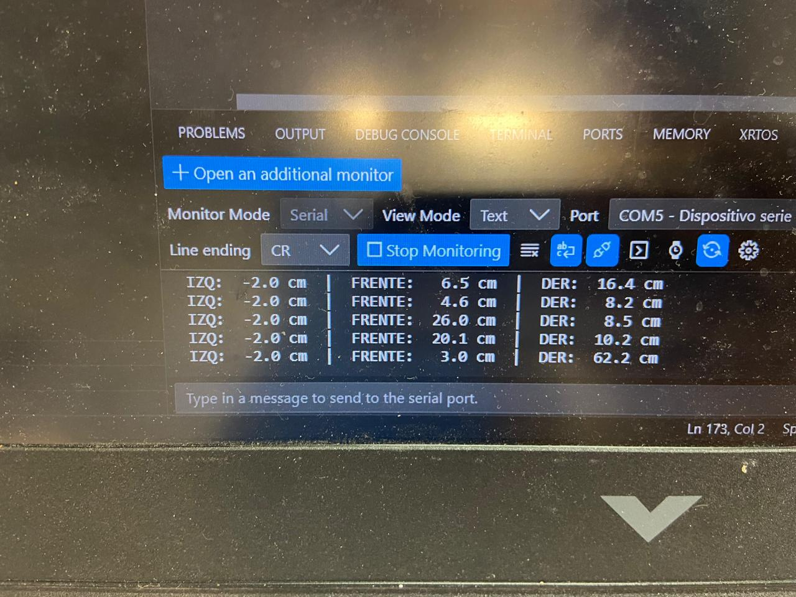
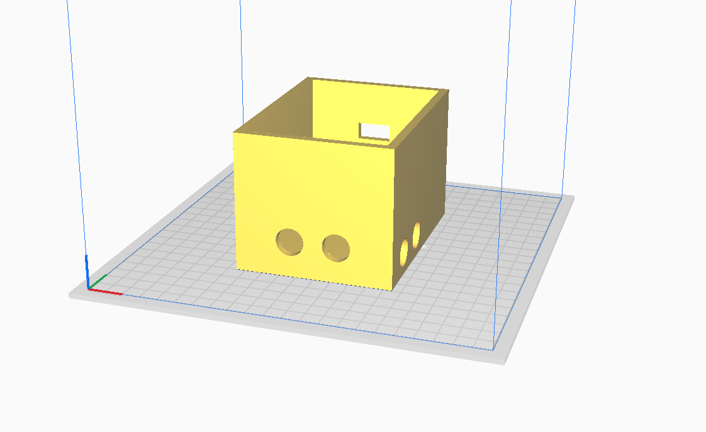
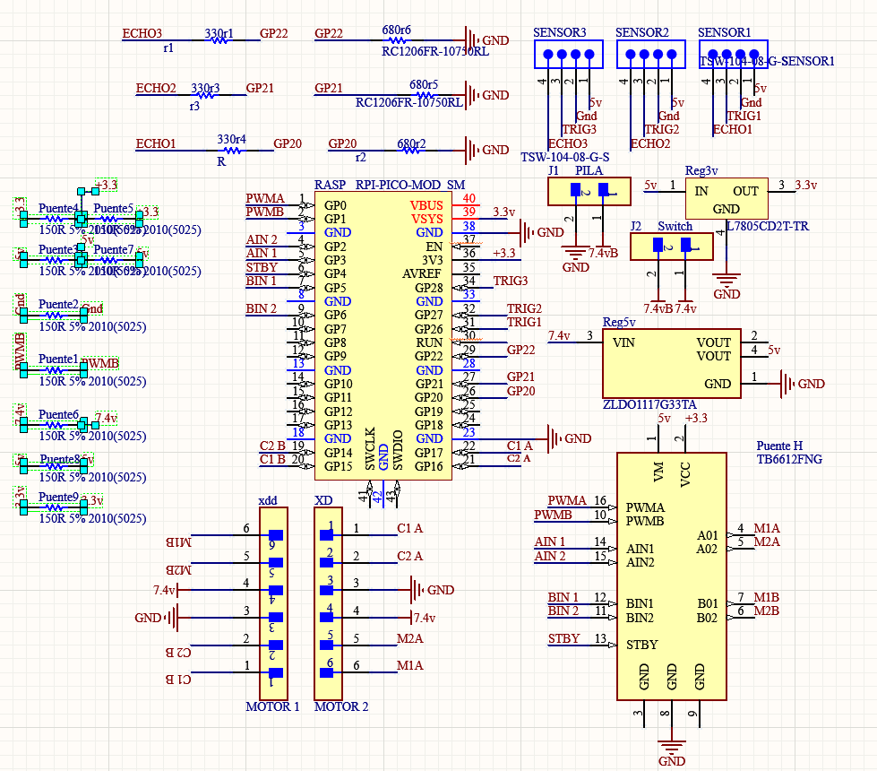

# 📚 **Proyecto Final**

## **Introducción**

- **Nombre del proyecto:** _Micromouse_  
- **Equipo / Autor(es):** _Rodrigo Miranda Flores_  
- **Curso / Asignatura:** _Sistemas embebidos 1_  
- **Fecha:** _08/12/2025_  
- **Descripción breve:** _En este apartado se muestran la creación de un micromouse._

1) **Que debe hacer:**
_El micromouse tiene como tarea resolver un laberinto de forma autonoma y eficiente._

### **Fase 1 - Pruebas**

1) **Descripción breve:**
_El micromouse fue practicado en una protoboard para probar funcionamiento de motores, sensores, pila y circuito._

2) **Codigos:**

- **Prueba de motores y sensores**
```
#include <stdio.h>
#include "pico/stdlib.h"
#include "hardware/pwm.h"
#include "hardware/gpio.h"
#include "hardware/timer.h"

const uint STBY = 10;
const uint PWMA = 6, AIN1 = 7, AIN2 = 8;
const uint PWMB = 9, BIN1 = 3, BIN2 = 2;
const uint TRIG = 11, ECHO = 12;

const float DISTANCIA_STOP = 15.0f;

void init_hardware() {
    stdio_init_all();

    gpio_init(STBY); gpio_set_dir(STBY, GPIO_OUT); gpio_put(STBY, 1);

    gpio_init(AIN1); gpio_set_dir(AIN1, GPIO_OUT);
    gpio_init(AIN2); gpio_set_dir(AIN2, GPIO_OUT);
    gpio_init(BIN1); gpio_set_dir(BIN1, GPIO_OUT);
    gpio_init(BIN2); gpio_set_dir(BIN2, GPIO_OUT);

    gpio_set_function(PWMA, GPIO_FUNC_PWM);
    gpio_set_function(PWMB, GPIO_FUNC_PWM);
    
    uint sliceA = pwm_gpio_to_slice_num(PWMA);
    uint sliceB = pwm_gpio_to_slice_num(PWMB);
    
    pwm_set_wrap(sliceA, 65535); pwm_set_enabled(sliceA, true);
    pwm_set_wrap(sliceB, 65535); pwm_set_enabled(sliceB, true);

    gpio_init(TRIG); gpio_set_dir(TRIG, GPIO_OUT); gpio_put(TRIG, 0);
    gpio_init(ECHO); gpio_set_dir(ECHO, GPIO_IN);
}

void mover(bool avanzar) {
    uint16_t velocidad = 60000;

    if (avanzar) {
        gpio_put(AIN1, 0); 
        gpio_put(AIN2, 1);
        gpio_put(BIN1, 0); 
        gpio_put(BIN2, 1);
        pwm_set_gpio_level(PWMA, velocidad);
        pwm_set_gpio_level(PWMB, velocidad);
    } else {
        gpio_put(AIN1, 0); gpio_put(AIN2, 0);
        gpio_put(BIN1, 0); gpio_put(BIN2, 0);
        pwm_set_gpio_level(PWMA, 0);
        pwm_set_gpio_level(PWMB, 0);
    }
}

float leer_distancia() {
    gpio_put(TRIG, 1); sleep_us(10); gpio_put(TRIG, 0);
    
    absolute_time_t timeout = make_timeout_time_ms(30);

    while(gpio_get(ECHO) == 0) {
        if(absolute_time_diff_us(get_absolute_time(), timeout) < 0) return 0.0;
    }
    absolute_time_t start = get_absolute_time();

    while(gpio_get(ECHO) == 1) {
        if(absolute_time_diff_us(get_absolute_time(), timeout) < 0) return 0.0;
    }
    absolute_time_t end = get_absolute_time();

    return (float)absolute_time_diff_us(start, end) / 58.0f;
}

int main() {
    init_hardware();
    sleep_ms(3000);

    printf("--- INICIANDO TEST (DIRECCION CORREGIDA) ---\n");

    while (true) {
        float distancia = leer_distancia();
        
        if (distancia > 0.1) {
            printf("Distancia: %.1f cm\n", distancia);

            if (distancia < DISTANCIA_STOP) {
                mover(false);
            } else {
                mover(true);
            }
        }
        sleep_ms(50);
    }
}

```

- **Prueba de sensores**
```
#include <stdio.h>
#include "pico/stdlib.h"
#include "hardware/gpio.h"
#include "hardware/timer.h"

class Sensor {
private:
    uint _trig, _echo;
public:
    Sensor(uint trig, uint echo) : _trig(trig), _echo(echo) {
        gpio_init(_trig); gpio_set_dir(_trig, GPIO_OUT); gpio_put(_trig, 0);
        gpio_init(_echo); gpio_set_dir(_echo, GPIO_IN);
    }

    float leer() {
        gpio_put(_trig, 0); sleep_us(2);
        gpio_put(_trig, 1); sleep_us(10);
        gpio_put(_trig, 0);

        absolute_time_t timeout = make_timeout_time_ms(30);

        while (gpio_get(_echo) == 0) {
            if (absolute_time_diff_us(get_absolute_time(), timeout) < 0) return -1.0;
        }
        absolute_time_t start = get_absolute_time();

        while (gpio_get(_echo) == 1) {
            if (absolute_time_diff_us(get_absolute_time(), timeout) < 0) return -1.0;
        }
        absolute_time_t end = get_absolute_time();

        return (float)absolute_time_diff_us(start, end) / 58.0f;
    }
};

Sensor izq(15, 18);
Sensor frente(11, 12);
Sensor der(26, 27);

int main() {
    stdio_init_all();
    sleep_ms(3000);
    printf("\n--- INICIANDO TEST DE 3 SENSORES ---\n");

    while (true) {
        float dI = izq.leer();
        sleep_ms(5);
        float dF = frente.leer();
        sleep_ms(5);
        float dD = der.leer();
        sleep_ms(5);

        printf("IZQ: %5.1f cm  |  FRENTE: %5.1f cm  |  DER: %5.1f cm\n", dI, dF, dD);

        sleep_ms(500);
    }
    return 0;
}
```

3) **Esquematico de conexion:**


4) **Evidencias**

**Pruerba de sensores de proximidad**


**Prueba de motores**<div style="position: relative; width: 100%; height: 0; padding-top: 56.25%; margin-bottom: 1em;">
  <iframe
    src="https://www.youtube.com/embed/hcj5_CNgCrY"
    style="position: absolute; width: 100%; height: 100%; top: 0; left: 0; border: none;"
    allow="accelerometer; autoplay; clipboard-write; encrypted-media; gyroscope; picture-in-picture; web-share"
    allowfullscreen>
  </iframe>
</div>

5) **Otras Pruebas**

- **Prueba de PIO (Programmable I/O)**
_Se verificó que los periféricos controlados por PIO para la lectura de encoders y generación de señales PWM funcionaran sin bloquear la CPU._
_Se midió que las rutinas en PIO mantuvieran el mismo periodo y no perdieran pulsos del encoder._

- **Prueba de DMA**
_Se usó DMA para mover datos._
_La prueba consistió en confirmar que las transferencias no perdieran datos y que la CPU permaneciera libre durante la operación._

- **Prueba de UART**
_Se probó el enlace UART para configurar y monitorear al robot._
_La prueba consistió en enviar comandos y verificar que no hubiera errores de transmisión ni desbordes en los buffers._

- **Prueba de WDT**
_Se activó el watchdog para reiniciar la MCU en caso de bloqueo del programa._
_La prueba consistió en “congelar” intencionalmente el código para verificar que el WDT hiciera el reinicio de forma segura._

- **Prueba de Energía**
_Se midió el voltaje de las líneas de 7.4V, 5V y 3.3V durante carga de motores._
_La prueba verificó que los reguladores mantuvieran el voltaje estable sin caídas peligrosas._

- **Prueba de EMC**
_Se revisó que el ruido de los motores y del puente H no afectara los sensores ni la Raspberry Pi Pico._

### **Fase 2 - Ensamblado**

1) **Descripción breve:**
_Una vez probado el circuito y componentes sigue el diseño y fabricaión de la PCB en Altium Designer y su soldado de componentes e impresión de piezas en 3D._

2) **PCB:**


3) **Diseño de piezas 3D**



### **Fase 3 - Final**

1) **Descripción breve:**
_Ya que tenemos nuestro micromouse probado y ensamblado ahora queda programarlo para que recorra el laberinto por si solo._

2) **Codigo:**

```
:(
```

3) **Esquematico de conexion:**


4) **Video:**

:(

### Aprendizajes:

- **Consideración de tiempos:**
_Mejorar la optimización de tiempos considerados y usados, fortalecer el trabajo en equipo para ciertas etapas del micromouse puesto que por el tiempo era algo reducido_

- **Tiempos de ejecución:**
_Medir el tiempo que tardan las funciones (sensado, control, motores) ayuda a saber si el robot puede reaccionar lo suficientemente rápido dentro del laberinto._
_Si una tarea tarda demasiado, el robot se vuelve lento o impreciso._

- **Jitter:**
_El jitter es la variación del tiempo entre cada ciclo de control._
_Si el jitter es alto, los motores reciben comandos irregulares y el robot avanza con “micro sacudidas”._

- **Pérdidas FIFO/DMA:**
_Cuando no se vacian a tiempo el FIFO o no se configura bien el DMA, se pierden datos._
_Esto afecta sensores y telemetría._
_Ajustar prioridades y tamaños de buffer evita esas pérdidas._

- **Consumo de energía:**
_Medir el consumo permitió saber cuánto duran realmente los motores, sensores y la MCU con la batería._
_Así se confirmó que el regulador y la batería deberían ser suficientes para terminar el recorrido sin apagarse._