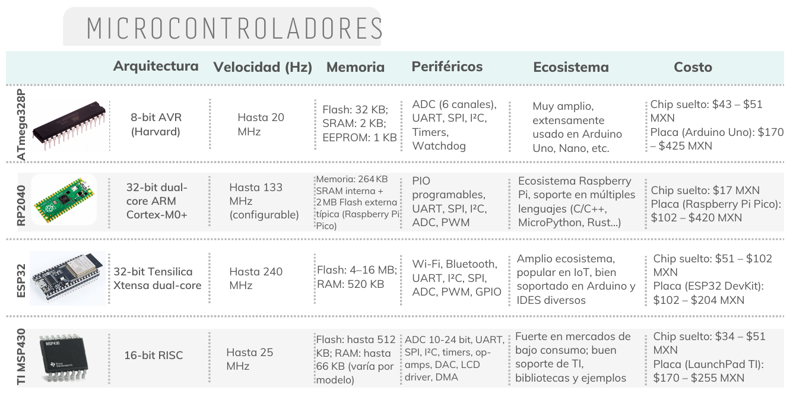

# 📚 Tarea 1

## **Introducción**

- **Nombre del proyecto:** _Tabla comparativa de microcontroladores_  
- **Equipo / Autor(es):** _Rodrigo Miranda Flores_  
- **Curso / Asignatura:** _Sistemas embebidos 1_  
- **Fecha:** _25/08/2025_  
- **Descripción breve:** _En este apartado se muestra un cuadro comparativo sobre microcontroladores elegidos por mi, mencionando cuales me parecen mejores, cuales usaría y porque._

1) **Cuadro comparativo**

_Elejí estos microcontroladores porque conozco a algunos y porque quise variar sus caracteristicas para compararlos mejor y no con uno muy similar._

_En mi opinión me gusta mas el ESP32 por sus perifericos, en segundo lugar pondria al ATmega328P por su uso en arduino ya conocido, en tercero seria RP2040 por la IA pero espero conocerlo más con posibilidad de subirlo de nviel, en cuarto dejo ap TI MSP430 porque no eh tenido la oportunidad de usarlo._

Para mi proyecto usaria este orden RP2040, ESP32, ATmega328P y al ultimo igualmente el TI MSP430.