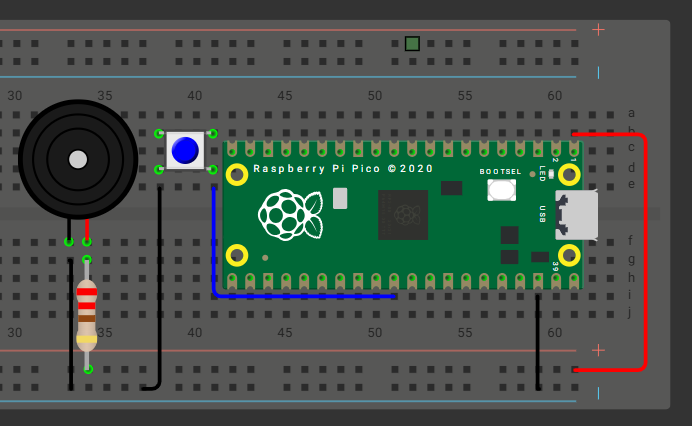
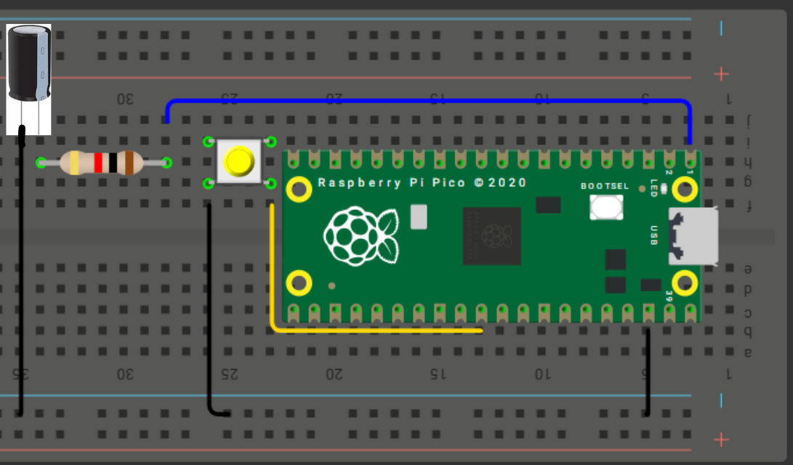
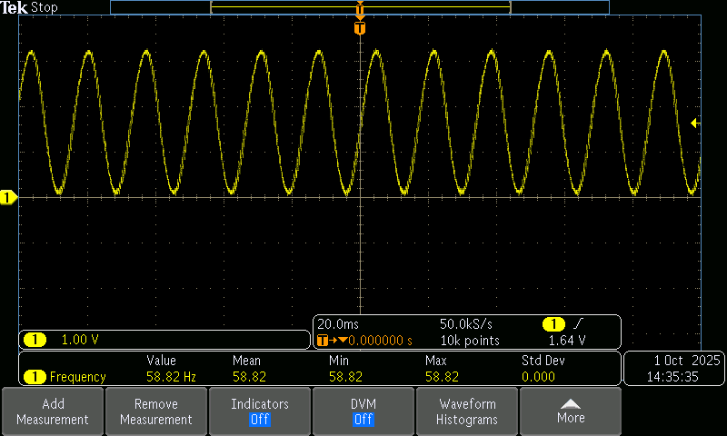

# 📚 **Tarea 7**

## **Introducción**

- **Nombre del proyecto:** _Ejercicios de medicion_  
- **Equipo / Autor(es):** _Rodrigo Miranda Flores_  
- **Curso / Asignatura:** _Sistemas embebidos 1_  
- **Fecha:** _01/10/2025_  
- **Descripción breve:** _En este apartado se muestran 3 ejercicios Control de Duty Cycle — Motor DC, Control de Frecuencia — Canción con Buzzer y Generación de Señales — Senoidal de 60 Hz con PWM + Filtro RC._

### **Control de Duty Cycle — Motor DC**

1) **Que debe hacer:**


_Implementar un circuito con un motor DC controlado mediante PWM variando el duty cycle._

_Usar 2 botones para seleccionar entre 3 velocidades predefinidas (baja, media y alta)._

2) **Codigo:**
```
#include "pico/stdlib.h"
#include "hardware/pwm.h"
#include <stdio.h>

#define PIN_PWM       0
#define PIN_AIN1      1
#define PIN_AIN2      2
#define PIN_STBY      3
#define PIN_BTN_UP    4
#define PIN_BTN_DOWN  5

#define PWM_TOP       625u
#define PWM_CLKDIV_VAL 10.0f

#define PCT_LOW   30.0f
#define PCT_MED   60.0f
#define PCT_HIGH  90.0f

#define DEBOUNCE_TIME_MS 50

static uint pwm_slice = 0;
static uint pwm_chan  = 0;
static uint32_t duty_table[3];

static void setup_pwm_pin(uint gpio_pin) {
    gpio_set_function(gpio_pin, GPIO_FUNC_PWM);
    pwm_slice = pwm_gpio_to_slice_num(gpio_pin);
    pwm_chan  = pwm_gpio_to_channel(gpio_pin);
    pwm_set_wrap(pwm_slice, PWM_TOP);
    pwm_set_clkdiv(pwm_slice, PWM_CLKDIV_VAL);
    pwm_set_chan_level(pwm_slice, pwm_chan, 0);
    pwm_set_enabled(pwm_slice, true);
}

static bool is_button_single_press(uint gpio_pin) {
    static absolute_time_t last_up = (absolute_time_t){0};
    static absolute_time_t last_down = (absolute_time_t){0};
    absolute_time_t *last = (gpio_pin == PIN_BTN_UP) ? &last_up : &last_down;

    if (gpio_get(gpio_pin) == 0) {
        absolute_time_t now = get_absolute_time();
        if (absolute_time_diff_us(*last, now) < (DEBOUNCE_TIME_MS * 1000)) {
            return false;
        }
        sleep_ms(10);
        if (gpio_get(gpio_pin) == 0) {
            *last = now;
            while (gpio_get(gpio_pin) == 0) sleep_ms(5);
            return true;
        }
    }
    return false;
}

int main() {
    stdio_init_all();

    gpio_init(PIN_AIN1); gpio_set_dir(PIN_AIN1, GPIO_OUT);
    gpio_init(PIN_AIN2); gpio_set_dir(PIN_AIN2, GPIO_OUT);
    gpio_init(PIN_STBY); gpio_set_dir(PIN_STBY, GPIO_OUT);

    gpio_init(PIN_BTN_UP);   gpio_set_dir(PIN_BTN_UP, GPIO_IN);   gpio_pull_up(PIN_BTN_UP);
    gpio_init(PIN_BTN_DOWN); gpio_set_dir(PIN_BTN_DOWN, GPIO_IN); gpio_pull_up(PIN_BTN_DOWN);

    setup_pwm_pin(PIN_PWM);

    duty_table[0] = (uint32_t)((PCT_LOW  / 100.0f) * (float)(PWM_TOP + 1));
    duty_table[1] = (uint32_t)((PCT_MED  / 100.0f) * (float)(PWM_TOP + 1));
    duty_table[2] = (uint32_t)((PCT_HIGH / 100.0f) * (float)(PWM_TOP + 1));

    int idx_speed = 0;

    gpio_put(PIN_AIN1, 1);
    gpio_put(PIN_AIN2, 0);

    gpio_put(PIN_STBY, 1);

    pwm_set_chan_level(pwm_slice, pwm_chan, duty_table[idx_speed]);

    printf("Motor control arrancado. PWM pin: %d\n", PIN_PWM);

    while (true) {
        if (is_button_single_press(PIN_BTN_UP)) {
            idx_speed = (idx_speed + 1) % 3;
            pwm_set_chan_level(pwm_slice, pwm_chan, duty_table[idx_speed]);
            printf("Velocidad -> %d (level=%u)\n", idx_speed, (unsigned)duty_table[idx_speed]);
        }
        if (is_button_single_press(PIN_BTN_DOWN)) {
            idx_speed = (idx_speed + 2) % 3;
            pwm_set_chan_level(pwm_slice, pwm_chan, duty_table[idx_speed]);
            printf("Velocidad -> %d (level=%u)\n", idx_speed, (unsigned)duty_table[idx_speed]);
        }
        sleep_ms(20);
    }

    return 0;
}
```
3) **Explicación de la frecuencia de corte:**

_El filtro RC se diseña para dejar pasar señales de 60 Hz y eliminar las componentes de alta frecuencia que provienen del PWM._

_La frecuencia de corte (fcf_cfc​) es el punto donde el filtro empieza a atenuar las señales. Matemáticamente:_


​
_En este caso, queremos que fc sea un poco mayor que 60 Hz para que nuestra señal sinusoidal de 60 Hz no sea atenuada._

4) **Esquematico de conexion:**


5) **Video:**

<div style="position: relative; width: 100%; height: 0; padding-top: 56.25%; margin-bottom: 1em;">
  <iframe src="https://www.youtube.com/embed/gje9RdGbTqA"
          style="position: absolute; width: 100%; height: 100%; top: 0; left: 0; border: none;"
          allowfullscreen>
  </iframe>
</div>

### **Control de Frecuencia — Canción con Buzzer**

1) **Que debe hacer:**


_Programar un buzzer piezoeléctrico para reproducir una melodía reconocible._

_Variar la frecuencia del PWM para las notas, manteniendo el duty en 50 %._

_Cada nota debe incluir su frecuencia y duración en el código._

2) **Codigo:**
```
#include "pico/stdlib.h"
#include "hardware/pwm.h"
#include <stdio.h>
 
#define PIN_BUZZER 0
#define TOP_PWM 1023
 
// tempo para esta melodía (tomado de los datos)
#define TEMPO 108
 
// límites para clkdiv (RP2040 funciona bien en ~1..255)
#define CLKDIV_MIN 1.0f
#define CLKDIV_MAX 255.0f
 
// duty fijo al 50%
#define DUTY_50 (TOP_PWM/2)
 
// estructura para representar una nota: frecuencia en Hz (0 = silencio) y token de duración
typedef struct {
    int frecuencia;   // Hz (0 = silencio)
    int token;        // token de duración (ej. 8 = corchea, -4 = puntillo)
} Nota;
 
// --- Melodía: "Star Wars theme" convertida ---
// Formato: {frecuencia_hz, token_duración}
// token: 8 = corchea, 4 = negra, 2 = blanca, 1 = redonda. Token negativo = puntillo (1.5×).
static const Nota melodia[] = {
    {466, 8}, {466, 8}, {466, 8}, {698, 2}, {1047, 2},
    {932, 8}, {880, 8}, {784, 8}, {1397, 2}, {1047, 4},
    {932, 8}, {880, 8}, {784, 8}, {1397, 2}, {1047, 4},
    {932, 8}, {880, 8}, {932, 8}, {784, 2},
    {523, 8}, {523, 8}, {523, 8}, {698, 2}, {1047, 2},
    {932, 8}, {880, 8}, {784, 8}, {1397, 2}, {1047, 4},
    {932, 8}, {880, 8}, {784, 8}, {1397, 2}, {1047, 4},
    {932, 8}, {880, 8}, {932, 8}, {784, 2},
    {523, -8}, {523, 16}, {587, -4}, {587, 8},
    {932, 8}, {880, 8}, {784, 8}, {698, 8}, {698, 8},
    {784, 8}, {880, 8}, {784, 4}, {587, 8}, {659, 4},
    {523, -8}, {523, 16}, {587, -4}, {587, 8},
    {932, 8}, {880, 8}, {784, 8}, {698, 8}, {1047, -8}, {784, 16}, {784, 2},
    {0, 8}, {523, 8}, {587, -4}, {587, 8},
    {932, 8}, {880, 8}, {784, 8}, {698, 8}, {698, 8},
    {784, 8}, {880, 8}, {784, 4}, {587, 8}, {659, 4},
    {1047, -8}, {1047, 16}, {1397, 4}, {1245, 8}, {1109, 4},
    {1047, 8}, {932, 4}, {831, 8}, {784, 4}, {698, 8}, {1047, 1}
};
 
static const int MELODIA_LEN = sizeof(melodia) / sizeof(melodia[0]);
 
// función auxiliar para limitar un valor float entre dos extremos
static inline float limitar_f(float v, float minimo, float maximo) {
    if (v < minimo) return minimo;
    if (v > maximo) return maximo;
    return v;
}
 
// calcula la duración en milisegundos a partir del tempo y el token de nota
int calcular_duracion_ms(int tempo, int token) {
    // nota entera en ms: (60000 / tempo) * 4
    float nota_entera = (60000.0f / tempo) * 4.0f;
    float duracion;
    if (token > 0) {
        duracion = nota_entera / (float)token;
    } else {
        // token negativo = puntillo (1.5x)
        duracion = nota_entera / (float)(-token);
        duracion *= 1.5f;
    }
    return (int)(duracion + 0.5f);
}
 
int main() {
    stdio_init_all();
 
    // inicializar PWM en el pin del buzzer
    gpio_set_function(PIN_BUZZER, GPIO_FUNC_PWM);
    uint slice = pwm_gpio_to_slice_num(PIN_BUZZER);
    uint canal = pwm_gpio_to_channel(PIN_BUZZER);
    pwm_set_wrap(slice, TOP_PWM);
    pwm_set_chan_level(slice, canal, 0);
    pwm_set_enabled(slice, true);
 
    const int tempo = TEMPO;
 
    while (true) {
        for (int i = 0; i < MELODIA_LEN; i++) {
            int freq = melodia[i].frecuencia;
            int token = melodia[i].token;
 
            int notaMs = calcular_duracion_ms(tempo, token);
 
            if (freq == 0) {
                // silencio
                pwm_set_chan_level(slice, canal, 0);
                sleep_ms((int)(notaMs * 0.9f));
                // pequeña pausa (10%)
                sleep_ms((int)(notaMs * 0.1f));
                continue;
            }
 
            // calcular clkdiv para la frecuencia solicitada
            const float f_clk = 125000000.0f;
            float clkdiv = f_clk / ((float)freq * (TOP_PWM + 1));
            clkdiv = limitar_f(clkdiv, CLKDIV_MIN, CLKDIV_MAX);
            pwm_set_clkdiv(slice, clkdiv);
 
            // duty al 50%
            pwm_set_chan_level(slice, canal, DUTY_50);
 
            // reproducir 90% de la duración de la nota
            sleep_ms((int)(notaMs * 0.9f));
 
            // silencio 10%
            pwm_set_chan_level(slice, canal, 0);
            sleep_ms((int)(notaMs * 0.1f));
        }
 
        // pequeña pausa antes de repetir la melodía completa
        sleep_ms(1500);
    }
 
    return 0;
}
```

3) **Esquematico de conexion:**


4) **Video:**

<div style="position: relative; width: 100%; height: 0; padding-top: 56.25%; margin-bottom: 1em;">
  <iframe src="https://www.youtube.com/embed/zC1VOr3whbY" 
          style="position: absolute; width: 100%; height: 100%; top: 0; left: 0; border: none;"
          allowfullscreen>
  </iframe>
</div>

### **Generación de Señales — Senoidal de 60 Hz con PWM + Filtro RC**

1) **Que debe hacer:**

_Generar una señal sinusoidal aproximada de 60 Hz variando el duty cycle del PWM según una función seno._

_Construir un filtro RC pasabajos básico y verificar la señal en el osciloscopio:_

2) **Codigo:**
```
#include <stdio.h>
#include <math.h>
#include "pico/stdlib.h"
#include "hardware/pwm.h"

#define PIN_OUT       0
#define PWM_RES       1023
#define WAVE_FREQ     60
#define TABLE_SIZE    100

uint16_t seno_table[TABLE_SIZE];

int main() {
    stdio_init_all();

    for (uint i = 0; i < TABLE_SIZE; i++) {
        double angle = (2.0 * M_PI * i) / (double)TABLE_SIZE;
        double scaled = (sin(angle) + 1.0) * 0.5;
        seno_table[i] = (uint16_t)(scaled * PWM_RES);
    }

    gpio_set_function(PIN_OUT, GPIO_FUNC_PWM);
    uint slice_num = pwm_gpio_to_slice_num(PIN_OUT);
    uint channel   = pwm_gpio_to_channel(PIN_OUT);

    pwm_set_wrap(slice_num, PWM_RES);
    pwm_set_chan_level(slice_num, channel, 0);
    pwm_set_enabled(slice_num, true);

    double update_rate = WAVE_FREQ * TABLE_SIZE;
    uint32_t wait_us = (uint32_t)(1000000.0 / update_rate);

    uint idx = 0;
    while (true) {
        pwm_set_chan_level(slice_num, channel, seno_table[idx]);
        idx = (idx + 1) % TABLE_SIZE;
        sleep_us(wait_us);
    }

    return 0;
}

```

3) **Esquematico de conexion:**


4) **Fotos:**

