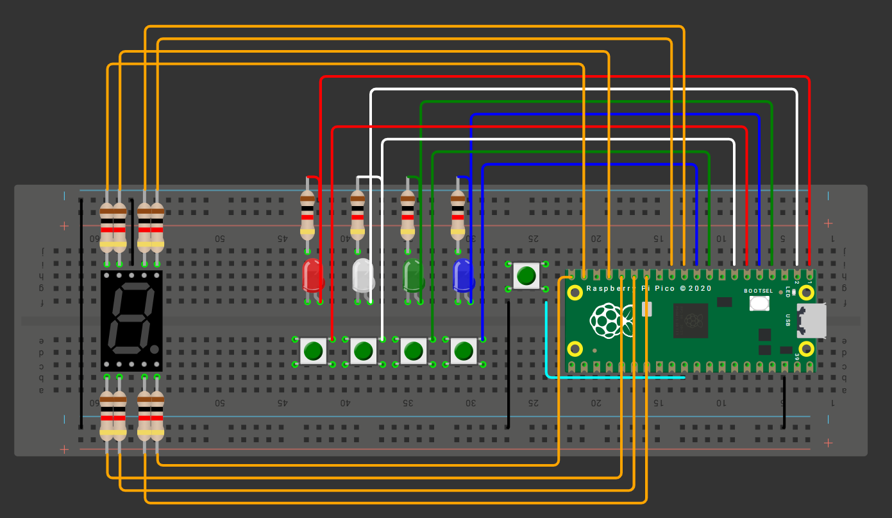

# 📚 **Examen 1**

## **Introducción**

- **Nombre del proyecto:** _Simón Dice (4 colores) – RP Pico 2_  
- **Equipo / Autor(es):** _Rodrigo Miranda Flores_  
- **Curso / Asignatura:** _Sistemas embebidos 1_  
- **Fecha:** _22/09/2025_  
- **Descripción breve:** _En este apartado se muestra mi primer examen el cual es el juego "Simón dice" con 4 leds de diferentes colores, todo programado con una Raspberry pi pico2._

### **Ejercicio 1**

1) **Que debe hacer:**

- _Construir un juego Simón Dice de 4 colores en Raspberry Pi Pico 2._


- _La secuencia crece +1 por ronda, de 1 hasta 15._


- _La persona jugadora debe repetir la secuencia con 4 botones dentro de un tiempo límite por ronda._


- _Tiempo límite por ronda (fase de entrada): TL = longitud + 5 segundos (p. ej., Ronda 7 → 12 s)._


- _Puntaje (0–15): mostrar la máxima ronda alcanzada en un display de 7 segmentos en hex (0–9, A, b, C, d, E, F)._


- _Aleatoriedad obligatoria: la secuencia debe ser impredecible en cada ejecución._

2) **Reglas del juego**

- _Encendido/Reset: el 7 segmentos muestra “0” y queda en espera de Start (cualquier botón permite iniciar)._

- _Reproducción: mostrar la secuencia actual (LEDs uno por uno con separación clara)._

- _Entrada: al terminar la reproducción, la persona debe repetir la secuencia completa dentro de TL._

- _Fallo (Game Over): botón incorrecto, falta/extra de entradas o exceder TL._

- _Progresión: si acierta, puntaje = número de ronda, agrega 1 color aleatorio y avanza._

- _Fin: al fallar o completar la Ronda 15. Mostrar puntaje final en 7 segmentos (hex)._

3) **Codigo:**
```
#include "pico/stdlib.h"
#include "hardware/gpio.h"
#include "hardware/timer.h"
#include <stdlib.h>


#define LED_RED    0
#define LED_GREEN  1
#define LED_BLUE   2
#define LED_YELLOW 3

#define BTN_RED    4
#define BTN_GREEN  5
#define BTN_BLUE   6
#define BTN_YELLOW 7

#define SEG_A 8
#define SEG_B 9
#define SEG_C 10
#define SEG_D 11
#define SEG_E 12
#define SEG_F 13
#define SEG_G 14
#define SEG_DP 15

#define MAX_RONDA 15

//Estado del juego
uint8_t secuencia[MAX_RONDA];  //secuencia de colores (0–3)
uint8_t ronda_actual = 0;

//Mapeo de LEDs y botones
const uint8_t leds[4] = {LED_RED, LED_GREEN, LED_BLUE, LED_YELLOW};
const uint8_t botones[4] = {BTN_RED, BTN_GREEN, BTN_BLUE, BTN_YELLOW};

//Tabla de 7 segmentos (0–F)
const uint8_t tabla7seg[16] = {
    0b0111111, // 0
    0b0000110, // 1
    0b1011011, // 2
    0b1001111, // 3
    0b1100110, // 4
    0b1101101, // 5
    0b1111101, // 6
    0b0000111, // 7
    0b1111111, // 8
    0b1101111, // 9
    0b1110111, // A
    0b1111100, // b
    0b0111001, // C
    0b1011110, // d
    0b1111001, // E
    0b1110001  // F
};

//Inicialización
void init_leds() {
    for(int i=0;i<4;i++) {
        gpio_init(leds[i]);
        gpio_set_dir(leds[i], GPIO_OUT);
        gpio_put(leds[i],0);
    }
}

void init_botones() {
    for(int i=0;i<4;i++) {
        gpio_init(botones[i]);
        gpio_set_dir(botones[i], GPIO_IN);
        gpio_pull_up(botones[i]);
    }
}

void init_display() {
    for(int i=SEG_A;i<=SEG_G;i++){
        gpio_init(i);
        gpio_set_dir(i, GPIO_OUT);
        gpio_put(i,0);
    }
}

//Mostrar en 7 segmentos
void mostrar_hex(uint8_t val){
    uint8_t mask = tabla7seg[val & 0x0F];
    for(int i=0;i<7;i++){
        gpio_put(SEG_A+i, (mask>>i)&1);
    }
}

//Reproducir secuencia
void reproducir_secuencia(uint8_t longitud){
    for(int i=0;i<longitud;i++){
        gpio_put(leds[secuencia[i]],1);
        sleep_ms(500);
        gpio_put(leds[secuencia[i]],0);
        sleep_ms(250);
    }
}

//Leer entrada del jugador con límite de tiempo
bool leer_entrada(uint8_t ronda){
    uint32_t inicio = to_us_since_boot(get_absolute_time());
    uint32_t limite = (ronda + 5) * 1000000u; //tiempo límite en µs

    for(int i = 0; i < ronda; i++){
        bool respondio = false;
        while(to_us_since_boot(get_absolute_time()) - inicio < limite){
            for(int j = 0; j < 4; j++){
                if(!gpio_get(botones[j])){ //botón presionado
                    sleep_ms(50); //debouncing
                    if(!gpio_get(botones[j])){ //sigue presionado
                        if(j == secuencia[i]){
                            respondio = true; //fue correcto
                        } else {
                            //Botón incorrecto → Game Over
                            return false;
                        }

                        //esperar hasta que TODOS los botones estén liberados
                        bool todos_sueltos = false;
                        while(!todos_sueltos){
                            todos_sueltos = true;
                            for(int k = 0; k < 4; k++){
                                if(!gpio_get(botones[k])) todos_sueltos = false;
                            }
                            sleep_ms(10);
                        }
                        break;
                    }
                }
            }
            if(respondio) break; //salir del while
        }
        if(!respondio){
            //Timeout → Game Over
            return false;
        }
    }
    return true; //toda la secuencia correcta
}


//Agregar nuevo color aleatorio
void agregar_color(){
    secuencia[ronda_actual] = rand()%4;
    ronda_actual++;
}

//Main
int main(){
    stdio_init_all();
    init_leds();
    init_botones();
    init_display();
    mostrar_hex(0); //espera de inicio

    while(true){
        //esperar botón para iniciar
        while(gpio_get(BTN_RED) && gpio_get(BTN_GREEN) &&
              gpio_get(BTN_BLUE) && gpio_get(BTN_YELLOW)){
            tight_loop_contents();
        }

        ronda_actual=0;
        srand(to_us_since_boot(get_absolute_time())); // semilla aleatoria
        agregar_color(); //primer color

       while(ronda_actual <= MAX_RONDA){
    mostrar_hex(ronda_actual);
    reproducir_secuencia(ronda_actual);

    if(!leer_entrada(ronda_actual)){
        //Game Over: reiniciar a estado inicial
        ronda_actual = 0;
        mostrar_hex(0);

        //esperar nuevo botón para empezar de cero
        while(gpio_get(BTN_RED) && gpio_get(BTN_GREEN) &&
              gpio_get(BTN_BLUE) && gpio_get(BTN_YELLOW)){
            tight_loop_contents();
        }

        srand(to_us_since_boot(get_absolute_time())); // nueva semilla
        agregar_color(); //nueva secuencia desde 1
        continue; //volver a empezar
    }

    if(ronda_actual == MAX_RONDA) break; //Ronda 15 completada

    agregar_color(); //siguiente ronda
}

        //Victoria: parpadear LEDs y mostrar 'F' en 7 segmentos
        for(int i=0;i<5;i++){
            for(int j=0;j<4;j++) gpio_put(leds[j],1);
            mostrar_hex(0xF);
            sleep_ms(500);
            for(int j=0;j<4;j++) gpio_put(leds[j],0);
            mostrar_hex(0);
            sleep_ms(500);
        }

        //esperar nuevo botón para empezar de cero
        while(gpio_get(BTN_RED) && gpio_get(BTN_GREEN) &&
              gpio_get(BTN_BLUE) && gpio_get(BTN_YELLOW)){
            tight_loop_contents();
        }
    }

    return 0;
}
```

4) **Esquematico de conexion:**


5) **Video:**

[Video en youtube](https://youtube.com/shorts/YFGwNF2riHw)