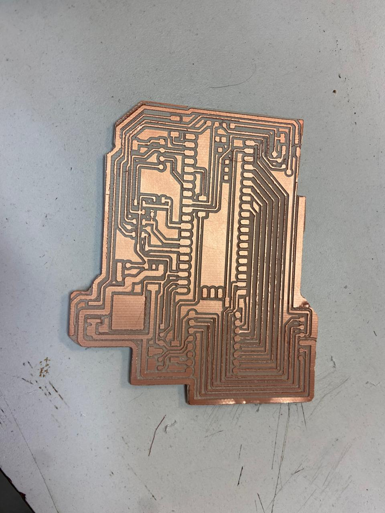
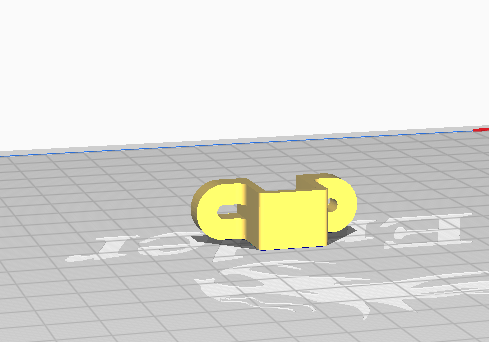

# 📚 **Proyecto Final**

## **Introducción**

- **Nombre del proyecto:** _Micromouse_  
- **Equipo / Autor(es):** _Rodrigo Miranda Flores_  
- **Curso / Asignatura:** _Sistemas embebidos 1_  
- **Fecha:** _08/12/2025_  
- **Descripción breve:** _En este apartado se muestran la creación de un micromouse._

1) **Que debe hacer:**
_El micromouse tiene como tarea resolver un laberinto de forma autonoma y eficiente._

### Fase 1:

1) **Descripción breve:**
_El micromouse fue practicado en una protoboard para probar funcionamiento de motores, sensores, pila y circuito._
2) **Codigo:**

```

```

3) **Esquematico de conexion:**


4) **Videos:**

<div style="position: relative; width: 100%; height: 0; padding-top: 56.25%; margin-bottom: 1em;">
  <iframe src="https://www.youtube.com//BpNMVizb54Y"
          style="position: absolute; width: 100%; height: 100%; top: 0; left: 0; border: none;"
          allowfullscreen>
  </iframe>
</div>

### Fase 1 - Pruebas:

1) **Descripción breve:**
_Una vez probado el circuito y componentes sigue el diseño de la PCB en altium disagner._

2) **Pruebas**

- **Prueba de PIO (Programmable I/O)**
_Se verificó que los periféricos controlados por PIO para la lectura de encoders y generación de señales PWM funcionaran sin bloquear la CPU._
_Se midió que las rutinas en PIO mantuvieran el mismo periodo y no perdieran pulsos del encoder._

- **Prueba de DMA**
_Se usó DMA para mover datos._
_La prueba consistió en confirmar que las transferencias no perdieran datos y que la CPU permaneciera libre durante la operación._

- **Prueba de UART**
_Se probó el enlace UART para configurar y monitorear al robot._
_La prueba consistió en enviar comandos y verificar que no hubiera errores de transmisión ni desbordes en los buffers._

- **Prueba de WDT**
_Se activó el watchdog para reiniciar la MCU en caso de bloqueo del programa._
_La prueba consistió en “congelar” intencionalmente el código para verificar que el WDT hiciera el reinicio de forma segura._

- **Prueba de Energía**
_Se midió el voltaje de las líneas de 7.4V, 5V y 3.3V durante carga de motores._
_La prueba verificó que los reguladores mantuvieran el voltaje estable sin caídas peligrosas._

- **Prueba de EMC**
_Se revisó que el ruido de los motores y del puente H no afectara los sensores ni la Raspberry Pi Pico._

) **Codigo:**

```

```

) **Esquematico de conexion:**


) **Evidencia:**

**Pruerba de sensores de proximidad**


**Prueba de motores**<div style="position: relative; width: 100%; height: 0; padding-top: 56.25%; margin-bottom: 1em;">
  <iframe
    src="https://www.youtube.com/embed/hcj5_CNgCrY"
    style="position: absolute; width: 100%; height: 100%; top: 0; left: 0; border: none;"
    allow="accelerometer; autoplay; clipboard-write; encrypted-media; gyroscope; picture-in-picture; web-share"
    allowfullscreen>
  </iframe>
</div>

### Fase 2 - Ensamblado:

1) **Descripción breve:**
_Una vez probado el circuito y componentes sigue el diseño de la PCB en Altium Designer e impresión de piezas en 3D._

2) **PCB:**



3) **Diseño de piezas 3D**



### Fase 3 - Final:

1) **Descripción breve:**
_Ya que tenemos nuestro micromouse probado y ensamblado ahora queda programarlo para que recorra el laberinto por si solo._

2) **Codigo:**

```

```

3) **Esquematico de conexion:**


4) **Video:**