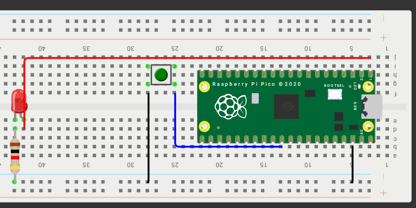
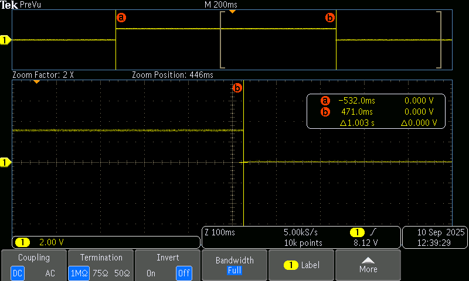

# 📚 **Tarea 5**

## **Introducción**

- **Nombre del proyecto:** _Ejercicios de medicion_  
- **Equipo / Autor(es):** _Rodrigo Miranda Flores_  
- **Curso / Asignatura:** _Sistemas embebidos 1_  
- **Fecha:** _15/09/2025_  
- **Descripción breve:** _En este apartado se muestran 2 ejercicios de medición con osciloscopio._

### **(Ejercicio 1) Medición en osciloscopio del periodo y jitter usando ALARM0 (modo µs)**

1) **Que debe hacer:**
_Genera una onda cuadrada por toggle de un pin de salida en la ISR de ALARM0, con rearme acumulativo y periodo nominal definido por ti (p. ej., 100 µs–5 ms). Mide con osciloscopio:
- Periodo promedio y tolerancia.
- Jitter pico-a-pico y, si tu equipo lo permite, RMS.
- Describe la configuración del osciloscopio (acoplamiento, escala de tiempo/voltaje, modo de medición). No cambiar la resolución del timer (mantener modo µs).._

2) **Codigo:**
```
// Blink con timer de sistema (bajo nivel): programando ALARM0 e IRQ
#include "pico/stdlib.h"
#include "hardware/irq.h"
#include "hardware/structs/timer.h"
 
#define LED_PIN       0
#define ALARM_NUM     1  // usaremos la alarma 1
 
// Calcula el número de IRQ para esa alarma
#define ALARM_IRQ     timer_hardware_alarm_get_irq_num(timer_hw, ALARM_NUM)
 
static volatile uint32_t next_deadline;   // próximo instante (en us) en 32 bits bajos
// Por defecto el timer cuenta µs (no cambiamos la fuente).
static volatile uint32_t intervalo_us = 100000u;    // periodo en microsegundos
 
void on_alarm_irq(void) {
    // 1) Limpiar el flag de la alarma
    hw_clear_bits(&timer_hw->intr, 1u << ALARM_NUM);
 
    // 2) Hacer el trabajo toggle LED
    sio_hw->gpio_togl = 1u << LED_PIN;
 
    // 3) Rearmar la siguiente alarma con "deadline acumulativo"
    next_deadline += intervalo_us;
    timer_hw->alarm[ALARM_NUM] = next_deadline;
}
 
int main() {
    stdio_init_all();
 
    // Configura el LED
    gpio_init(LED_PIN);
    gpio_set_dir(LED_PIN, true);
 
    // "now" = 32 bits bajos del contador (tiempo en µs)
    uint32_t now_us = timer_hw->timerawl;          // lectura 32b (low) del contador
    next_deadline = now_us + intervalo_us;         // primer deadline
 
    // Programa la alarma
    timer_hw->alarm[ALARM_NUM] = next_deadline;
 
    // Crea un handler exclusivo para ligar el callback a la IRQ de la alarma
    irq_set_exclusive_handler(ALARM_IRQ, on_alarm_irq);
    // Habilita dentro del periférico TIMER la fuente de interrupción para la alarma ALARM_NUM inte = interrupt enable
    hw_set_bits(&timer_hw->inte, 1u << ALARM_NUM);
    //Habilita la IRQ en el NVIC (controlador de interrupciones del núcleo)
    irq_set_enabled(ALARM_IRQ, true);
 
    while (true) {
        // Mantén el bucle principal libre; lo pesado va aquí, no en la ISR
        tight_loop_contents();
    }
}
```

3) **Esquematico de conexion:**


4) **Muestras de la medicón**


5) **Video:**

[Video en youtube](https://youtube.com/shorts/lCiT8hK5L0s)

### **(Ejercicio 2) Comparar jitter/precisión con osciloscopio: modo µs vs modo ciclos**

1) **Que debe hacer:**
_Genera una señal por toggle en la ISR de ALARM0, primero en modo µs y luego en modo ciclos de clk_sys (mismo periodo nominal). En ambos casos:

- Usa rearme acumulativo.
- Mantén el resto del código idéntico.
Con el osciloscopio, mide y registra para cada modo:
- Periodo promedio y desviación respecto al nominal.
- Jitter pico-a-pico y/o RMS.
- Compara resultados y discute el compromiso entre resolución de tick y horizonte de programación.(mantener modo µs).._

2) **Codigo:**
```
// Blink con timer de sistema (bajo nivel): programando ALARM0 e IRQ
#include "pico/stdlib.h"
#include "hardware/irq.h"
#include "hardware/structs/timer.h"
 
#define LED_PIN       0
#define ALARM_NUM     1  // usaremos la alarma 1
 
// Calcula el número de IRQ para esa alarma
#define ALARM_IRQ     timer_hardware_alarm_get_irq_num(timer_hw, ALARM_NUM)
 
static volatile uint32_t next_deadline;   // próximo instante (en us) en 32 bits bajos
// Por defecto el timer cuenta µs (no cambiamos la fuente).
static volatile uint32_t intervalo_us = 100000u;    // periodo en microsegundos
 
void on_alarm_irq(void) {
    // 1) Limpiar el flag de la alarma
    hw_clear_bits(&timer_hw->intr, 1u << ALARM_NUM);
 
    // 2) Hacer el trabajo toggle LED
    sio_hw->gpio_togl = 1u << LED_PIN;
 
    // 3) Rearmar la siguiente alarma con "deadline acumulativo"
    next_deadline += intervalo_us;
    timer_hw->alarm[ALARM_NUM] = next_deadline;
}
 
int main() {
    stdio_init_all();
 
    // Configura el LED
    gpio_init(LED_PIN);
    gpio_set_dir(LED_PIN, true);
 
    // "now" = 32 bits bajos del contador (tiempo en µs)
    uint32_t now_us = timer_hw->timerawl;          // lectura 32b (low) del contador
    next_deadline = now_us + intervalo_us;         // primer deadline
 
    // Programa la alarma
    timer_hw->alarm[ALARM_NUM] = next_deadline;
 
    // Crea un handler exclusivo para ligar el callback a la IRQ de la alarma
    irq_set_exclusive_handler(ALARM_IRQ, on_alarm_irq);
    // Habilita dentro del periférico TIMER la fuente de interrupción para la alarma ALARM_NUM inte = interrupt enable
    hw_set_bits(&timer_hw->inte, 1u << ALARM_NUM);
    //Habilita la IRQ en el NVIC (controlador de interrupciones del núcleo)
    irq_set_enabled(ALARM_IRQ, true);
 
    while (true) {
        // Mantén el bucle principal libre; lo pesado va aquí, no en la ISR
        tight_loop_contents();
    }
}
```

3) **Esquematico de conexion:**


4) **Muestras de la medicón**


5) **Video:**

[Video en youtube](https://youtube.com/shorts/lCiT8hK5L0s)