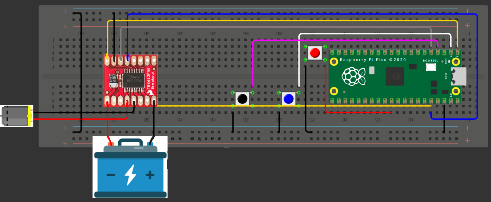

# 📚 **Tarea 7**

## **Introducción**

- **Nombre del proyecto:** _Ejercicios de medicion_  
- **Equipo / Autor(es):** _Rodrigo Miranda Flores_  
- **Curso / Asignatura:** _Sistemas embebidos 1_  
- **Fecha:** _01/10/2025_  
- **Descripción breve:** _En este apartado se muestran 3 ejercicios Control de Duty Cycle — Motor DC, Control de Frecuencia — Canción con Buzzer y Generación de Señales — Senoidal de 60 Hz con PWM + Filtro RC._

### **Control de Duty Cycle — Motor DC**

1) **Que debe hacer:**


_Implementar un circuito con un motor DC controlado mediante PWM variando el duty cycle._

_Usar 2 botones para seleccionar entre 3 velocidades predefinidas (baja, media y alta)._

2) **Codigo:**
```
// main.c
// Control PWM motor DC (Raspberry Pi Pico 2 + TB6612FNG) - C (Pico SDK)
// Pines TB6612FNG:
//   PWMA  <- GP0 (PWM motor A)
//   AIN1  <- GP1
//   AIN2  <- GP2
//   STBY  <- GP3 (o 3.3V directo si siempre activo)
// Botones:
//   BTN_INC <- GP4
//   BTN_DEC <- GP5
//
// Motor -> fuente externa (VM + GND), GND compartida con Pico
 
#include "pico/stdlib.h"
#include "hardware/pwm.h"
#include <stdio.h>
 
// ----- Pines -----
#define PWM_PIN     0
#define AIN1_PIN    1
#define AIN2_PIN    2
#define STBY_PIN    3
#define BTN_INC_PIN 4
#define BTN_DEC_PIN 5
 
// ----- PWM configuración ----
#define PWM_WRAP 625u
#define PWM_CLKDIV 10.0f
 
// ----- Velocidades -----
#define DUTY_LOW_PCT  30.0f
#define DUTY_MED_PCT  60.0f
#define DUTY_HIGH_PCT 90.0f
 
// Debounce
#define DEBOUNCE_MS 50
 
// Variables globales
static uint slice_num;
static uint chan;
static uint32_t duty_vals[3];
 
// ----- Funciones -----
static void pwm_init_for_pin(uint gpio_pin) {
    gpio_set_function(gpio_pin, GPIO_FUNC_PWM);
    slice_num = pwm_gpio_to_slice_num(gpio_pin);
    chan = pwm_gpio_to_channel(gpio_pin);
    pwm_set_wrap(slice_num, PWM_WRAP);
    pwm_set_clkdiv(slice_num, PWM_CLKDIV);
    pwm_set_chan_level(slice_num, chan, 0);
    pwm_set_enabled(slice_num, true);
}
 
static bool button_pressed_once(uint gpio_pin) {
    static absolute_time_t last_time_inc = {0};
    static absolute_time_t last_time_dec = {0};
    absolute_time_t *last_time = (gpio_pin == BTN_INC_PIN) ? &last_time_inc : &last_time_dec;
 
    if (gpio_get(gpio_pin) == 0) {
        absolute_time_t now = get_absolute_time();
        if (absolute_time_diff_us(*last_time, now) < (DEBOUNCE_MS * 1000)) return false;
        sleep_ms(10);
        if (gpio_get(gpio_pin) == 0) {
            *last_time = make_timeout_time_ms(DEBOUNCE_MS);
            while (gpio_get(gpio_pin) == 0) sleep_ms(5);
            return true;
        }
    }
    return false;
}
 
// ----- Main -----
int main() {
    stdio_init_all();
 
    // Inicializar pines
    gpio_init(AIN1_PIN); gpio_set_dir(AIN1_PIN, GPIO_OUT);
    gpio_init(AIN2_PIN); gpio_set_dir(AIN2_PIN, GPIO_OUT);
    gpio_init(STBY_PIN); gpio_set_dir(STBY_PIN, GPIO_OUT);
 
    gpio_init(BTN_INC_PIN); gpio_set_dir(BTN_INC_PIN, GPIO_IN); gpio_pull_up(BTN_INC_PIN);
    gpio_init(BTN_DEC_PIN); gpio_set_dir(BTN_DEC_PIN, GPIO_IN); gpio_pull_up(BTN_DEC_PIN);
 
    // PWM init
    pwm_init_for_pin(PWM_PIN);
 
    // Calcular duty levels
    duty_vals[0] = (uint32_t)((DUTY_LOW_PCT / 100.0f) * (float)(PWM_WRAP + 1));
    duty_vals[1] = (uint32_t)((DUTY_MED_PCT / 100.0f) * (float)(PWM_WRAP + 1));
    duty_vals[2] = (uint32_t)((DUTY_HIGH_PCT / 100.0f) * (float)(PWM_WRAP + 1));
 
    int speed_idx = 0; // baja
 
    // Dirección fija adelante
    gpio_put(AIN1_PIN, 1);
    gpio_put(AIN2_PIN, 0);
 
    // Habilitar TB6612
    gpio_put(STBY_PIN, 1);
 
    // Aplicar velocidad inicial
    pwm_set_chan_level(slice_num, chan, duty_vals[speed_idx]);
 
    printf("Control motor iniciado. PWM pin: %d\n", PWM_PIN);
 
    while (true) {
        if (button_pressed_once(BTN_INC_PIN)) {
            speed_idx = (speed_idx + 1) % 3;
            pwm_set_chan_level(slice_num, chan, duty_vals[speed_idx]);
            printf("Velocidad -> %d (level=%u)\n", speed_idx, (unsigned)duty_vals[speed_idx]);
        }
        if (button_pressed_once(BTN_DEC_PIN)) {
            speed_idx = (speed_idx + 2) % 3; // -1 con ciclo
            pwm_set_chan_level(slice_num, chan, duty_vals[speed_idx]);
            printf("Velocidad -> %d (level=%u)\n", speed_idx, (unsigned)duty_vals[speed_idx]);
        }
        sleep_ms(20);
    }
 
    return 0;
}
```

3) **Esquematico de conexion:**


4) **Video:**

<div style="position: relative; width: 100%; height: 0; padding-top: 56.25%; margin-bottom: 1em;">
  <iframe src="https://www.youtube.com/embed/gje9RdGbTqA"
          style="position: absolute; width: 100%; height: 100%; top: 0; left: 0; border: none;"
          allowfullscreen>
  </iframe>
</div>

### **Control de Frecuencia — Canción con Buzzer**

1) **Que debe hacer:**


_Programar un buzzer piezoeléctrico para reproducir una melodía reconocible._

_Variar la frecuencia del PWM para las notas, manteniendo el duty en 50 %._

_Cada nota debe incluir su frecuencia y duración en el código._

2) **Codigo:**
```
#include "pico/stdlib.h"
#include "hardware/pwm.h"
#include <stdio.h>
 
#define PIN_BUZZER 0
#define TOP_PWM 1023
 
// tempo para esta melodía (tomado de los datos)
#define TEMPO 108
 
// límites para clkdiv (RP2040 funciona bien en ~1..255)
#define CLKDIV_MIN 1.0f
#define CLKDIV_MAX 255.0f
 
// duty fijo al 50%
#define DUTY_50 (TOP_PWM/2)
 
// estructura para representar una nota: frecuencia en Hz (0 = silencio) y token de duración
typedef struct {
    int frecuencia;   // Hz (0 = silencio)
    int token;        // token de duración (ej. 8 = corchea, -4 = puntillo)
} Nota;
 
// --- Melodía: "Star Wars theme" convertida ---
// Formato: {frecuencia_hz, token_duración}
// token: 8 = corchea, 4 = negra, 2 = blanca, 1 = redonda. Token negativo = puntillo (1.5×).
static const Nota melodia[] = {
    {466, 8}, {466, 8}, {466, 8}, {698, 2}, {1047, 2},
    {932, 8}, {880, 8}, {784, 8}, {1397, 2}, {1047, 4},
    {932, 8}, {880, 8}, {784, 8}, {1397, 2}, {1047, 4},
    {932, 8}, {880, 8}, {932, 8}, {784, 2},
    {523, 8}, {523, 8}, {523, 8}, {698, 2}, {1047, 2},
    {932, 8}, {880, 8}, {784, 8}, {1397, 2}, {1047, 4},
    {932, 8}, {880, 8}, {784, 8}, {1397, 2}, {1047, 4},
    {932, 8}, {880, 8}, {932, 8}, {784, 2},
    {523, -8}, {523, 16}, {587, -4}, {587, 8},
    {932, 8}, {880, 8}, {784, 8}, {698, 8}, {698, 8},
    {784, 8}, {880, 8}, {784, 4}, {587, 8}, {659, 4},
    {523, -8}, {523, 16}, {587, -4}, {587, 8},
    {932, 8}, {880, 8}, {784, 8}, {698, 8}, {1047, -8}, {784, 16}, {784, 2},
    {0, 8}, {523, 8}, {587, -4}, {587, 8},
    {932, 8}, {880, 8}, {784, 8}, {698, 8}, {698, 8},
    {784, 8}, {880, 8}, {784, 4}, {587, 8}, {659, 4},
    {1047, -8}, {1047, 16}, {1397, 4}, {1245, 8}, {1109, 4},
    {1047, 8}, {932, 4}, {831, 8}, {784, 4}, {698, 8}, {1047, 1}
};
 
static const int MELODIA_LEN = sizeof(melodia) / sizeof(melodia[0]);
 
// función auxiliar para limitar un valor float entre dos extremos
static inline float limitar_f(float v, float minimo, float maximo) {
    if (v < minimo) return minimo;
    if (v > maximo) return maximo;
    return v;
}
 
// calcula la duración en milisegundos a partir del tempo y el token de nota
int calcular_duracion_ms(int tempo, int token) {
    // nota entera en ms: (60000 / tempo) * 4
    float nota_entera = (60000.0f / tempo) * 4.0f;
    float duracion;
    if (token > 0) {
        duracion = nota_entera / (float)token;
    } else {
        // token negativo = puntillo (1.5x)
        duracion = nota_entera / (float)(-token);
        duracion *= 1.5f;
    }
    return (int)(duracion + 0.5f);
}
 
int main() {
    stdio_init_all();
 
    // inicializar PWM en el pin del buzzer
    gpio_set_function(PIN_BUZZER, GPIO_FUNC_PWM);
    uint slice = pwm_gpio_to_slice_num(PIN_BUZZER);
    uint canal = pwm_gpio_to_channel(PIN_BUZZER);
    pwm_set_wrap(slice, TOP_PWM);
    pwm_set_chan_level(slice, canal, 0);
    pwm_set_enabled(slice, true);
 
    const int tempo = TEMPO;
 
    while (true) {
        for (int i = 0; i < MELODIA_LEN; i++) {
            int freq = melodia[i].frecuencia;
            int token = melodia[i].token;
 
            int notaMs = calcular_duracion_ms(tempo, token);
 
            if (freq == 0) {
                // silencio
                pwm_set_chan_level(slice, canal, 0);
                sleep_ms((int)(notaMs * 0.9f));
                // pequeña pausa (10%)
                sleep_ms((int)(notaMs * 0.1f));
                continue;
            }
 
            // calcular clkdiv para la frecuencia solicitada
            const float f_clk = 125000000.0f;
            float clkdiv = f_clk / ((float)freq * (TOP_PWM + 1));
            clkdiv = limitar_f(clkdiv, CLKDIV_MIN, CLKDIV_MAX);
            pwm_set_clkdiv(slice, clkdiv);
 
            // duty al 50%
            pwm_set_chan_level(slice, canal, DUTY_50);
 
            // reproducir 90% de la duración de la nota
            sleep_ms((int)(notaMs * 0.9f));
 
            // silencio 10%
            pwm_set_chan_level(slice, canal, 0);
            sleep_ms((int)(notaMs * 0.1f));
        }
 
        // pequeña pausa antes de repetir la melodía completa
        sleep_ms(1500);
    }
 
    return 0;
}
```

3) **Esquematico de conexion:**


4) **Video:**

<div style="position: relative; width: 100%; height: 0; padding-top: 56.25%; margin-bottom: 1em;">
  <iframe src="https://www.youtube.com/embed/zC1VOr3whbY" 
          style="position: absolute; width: 100%; height: 100%; top: 0; left: 0; border: none;"
          allowfullscreen>
  </iframe>
</div>

### **Generación de Señales — Senoidal de 60 Hz con PWM + Filtro RC**

1) **Que debe hacer:**

_Generar una señal sinusoidal aproximada de 60 Hz variando el duty cycle del PWM según una función seno._

_Construir un filtro RC pasabajos básico y verificar la señal en el osciloscopio:_

2) **Codigo:**
```

```

3) **Esquematico de conexion:**


4) **Video:**

Videoooooooooooo