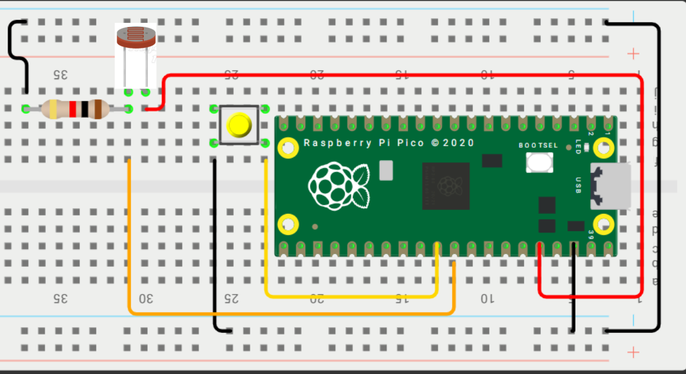

# 📚 **Tarea 9**

## **Introducción**

- **Nombre del proyecto:** _ADC_  
- **Equipo / Autor(es):** _Rodrigo Miranda Flores_  
- **Curso / Asignatura:** _Sistemas embebidos 1_  
- **Fecha:** _05/11/2025_  
- **Descripción breve:** _En este apartado se muestran 2 ejerciciosel primero es un luxometro y el segundo el control de un servomotor, ambos usando ADC._

### **Luxometro**

1) **Que debe hacer:**
_Crear medidor que marca la luminosidad de 0-100% usando un LDR._

2) **Codigo:**
```
#include <stdio.h>
#include "pico/stdlib.h"
#include "hardware/adc.h"
 
// Configurar el canal ADC a usar
#define ADC_INPUT 0 // canal 0
 
#define ADC_MIN 850    // valor cuando tapas la LDR
#define ADC_MAX 3100   // valor con luz máxima
 
int main() {
    stdio_init_all();
    adc_init();
    // Configura el pin GPIO correspondiente como entrada ADC
    adc_gpio_init(26); // GPIO26 suele mapear a ADC0 en Pico 2
    // Seleccionar canal
    adc_select_input(ADC_INPUT);
 
    while (true) {
        uint16_t adc = adc_read(); // 12 bits alineados a 0..4095
 
        if (adc < ADC_MIN) adc = ADC_MIN;
        if (adc > ADC_MAX) adc = ADC_MAX;
 
        // Calcular porcentaje de luz 0–100
        float luz = (adc - ADC_MIN) * 100.0f / (ADC_MAX - ADC_MIN);
 
        printf("ADC: %u\tLuz: %.1f%%\n", adc, luz);
        sleep_ms(200);
    }
}

```

3) **Esquematico de conexion:**


4) **Video:**

<div style="position: relative; width: 100%; height: 0; padding-top: 56.25%; margin-bottom: 1em;">
  <iframe src="https://www.youtube.com/embed/VtgWAUczVmI"
          style="position: absolute; width: 100%; height: 100%; top: 0; left: 0; border: none;"
          allowfullscreen>
  </iframe>
</div>

### **Control de Servomotor**

1) **Que debe hacer:**
_Mover un servo usando un potenciometro y un adc que vaya 0-180 grados._

2) **Codigo:**
```

```

3) **Esquematico de conexion:** _Usamos la misma conexión que en el ejercicio 1_


4) **Video:**

<div style="position: relative; width: 100%; height: 0; padding-top: 56.25%; margin-bottom: 1em;">
  <iframe src="https://www.youtube.com/embed/L8Vw-Pges6I"
          style="position: absolute; width: 100%; height: 100%; top: 0; left: 0; border: none;"
          allowfullscreen>
  </iframe>
</div>